# POS_Project : Cash Register with wx-widgets

### Project Description

A simple cash register system with squlite3 database.
Gets categories and products from the database and creates buttons for each item.
You can add products to an account, increment and decrement the amount of a product, delete products and clear the current account.
With the "Cash"-button the products on the current account list are written to the database and a textfile is created as an invoice.
With the "Closing"-button the daily-closing is done, summing up all sales, calculating the tax and writing the result to a textfile.



To compile this project use 
```
make
```
