# POS_Project : Registierkasse mit wx-widgets

### Projektbeschreibung

Erstellen einer GUI für ein einfaches Kassensystem das folgende Funktionen erfüllt:
- Angemeldeter Benutzer
- Erstellung einfacher Rechnungen mit Mehrwertsteuer, Rechnungnummer, Datum etc.
- Speicherung der Rechnungen in Datenbank
- Eigenverbrauch und Schwund
- Kassenabschluss

